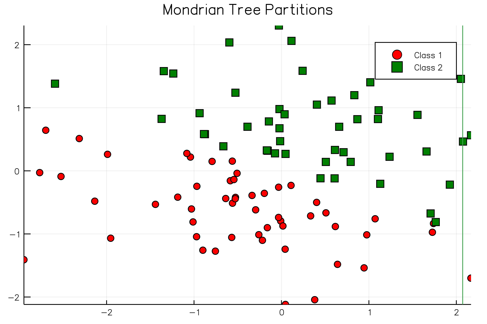

# Mondrian

## My parts of [this project](https://github.com/dominusmi/warwick-rsg/tree/master) 

Mondrian processes and Mondrian Forests

## Gif of splits of a ~90-95% accurate model

## Comparison with [Python](https://github.com/nel215/mondrianforest)

[Other package](https://github.com/balajiln/mondrianforest)

The amazing scaling of the algorithm is likely an issue with @time (or tic(),toq() et al) and
@parallel. The above is more like the next graph without @parallel (still very good). 
More investigation is required.

## Mondrian Process visualisation:

## References
- [Balaji Lakshminarayanan, Daniel M. Roy, Yee Whye Teh, Mondrian Forests: Efficient Online Random Forests, Advances in Neural Information Processing Systems 27 (NIPS), pages 3140-3148, 2014](http://arxiv.org/abs/1406.2673)
- [Balaji Lakshminarayanan, Daniel M. Roy, Yee Whye Teh, Mondrian Forests for Large-Scale Regression when Uncertainty Matters, Proceedings of the 19th International Conference on Artificial Intelligence and Statistics (AISTATS) 2016, Cadiz, Spain. JMLR: W&CP volume 51](https://arxiv.org/abs/1506.03805)
- [Matej Balog, Yee Whye Teh, The Mondrian Process for Machine Learning](http://arxiv.org/abs/1507.05181)

